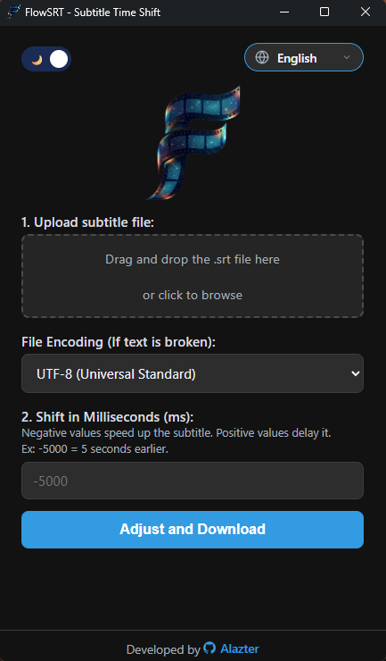

# 🎬 FlowSRT - Professional Subtitle Synchronizer

**FlowSRT** is a minimalist and powerful tool designed for synchronizing subtitle files (.srt) with surgical precision. Built with a focus on performance and high-fidelity design, it offers a seamless experience for quick timing adjustments.

  

## ✨ Highlights

-   🚀 **Fully Portable:** No installation required. Just download and run.
-   🌍 **Multilingual:** Full support for 19 languages (English, Portuguese, Spanish, Arabic, Chinese, and more).
-   🌗 **Dark & Light Modes:** Adaptive interface tailored to your workflow.
-   ⚡ **Drag & Drop:** Intuitive UX based on a seamless Drag & Drop zone.
-   ⚙️ **Fine-Tuning:** Millisecond-level control with support for multiple encodings (UTF-8 and ANSI).

## 🌐 Supported Languages

FlowSRT is localized for a global audience, covering over 19 major languages:

| | | | | |
| :--- | :--- | :--- | :--- | :--- |
| 🇺🇸 English | 🇧🇷 Portuguese | 🇪🇸 Spanish | 🇫🇷 French | 🇮🇹 Italian |
| 🇩🇪 German | 🇷🇺 Russian | 🇹🇷 Turkish | 🇨🇳 Chinese | 🇯🇵 Japanese |
| 🇰🇷 Korean | 🇸🇦 Arabic | 🇮🇳 Hindi | 🇧🇩 Bengali | 🇵🇰 Urdu |
| 🇮🇩 Indonesian | 🇹🇭 Thai | 🇻🇳 Vietnamese | 🇮🇳 Telugu | |

## 🚀 How to Use

1.  Go to the [Releases](https://github.com/alazter/flow-srt/releases/latest) tab.
2.  Download the version corresponding to your operating system:
    -   **Windows:** `.exe` (Portable)
    -   **macOS:** `.dmg`
    -   **Linux:** `.AppImage`
3.  Launch the app, drag your `.srt` file, set the shift time in milliseconds, and click **Adjust and Download**.

## 🛠️ Built With

-   [Electron](https://www.electronjs.org/) - Framework for native desktop apps.
-   [JavaScript/HTML5/CSS3] - Core application logic and styling.
-   [GitHub Actions] - Multi-platform CI/CD for automated builds and releases.

## 👤 Author

Developed by **Alazter**.
*Vibe coding enthusiast.*

---
© 2026 FlowSRT.